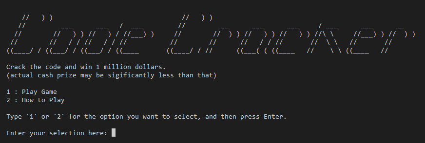
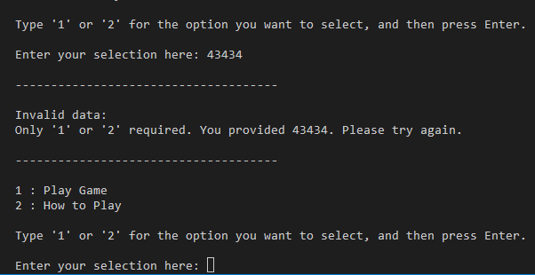
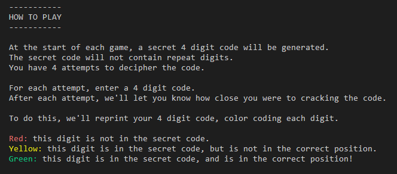
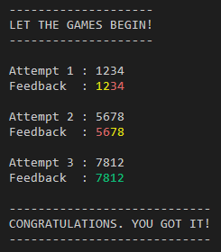
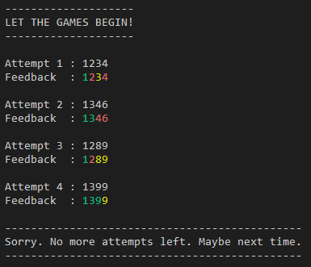
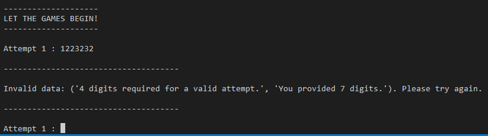
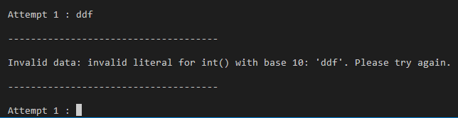
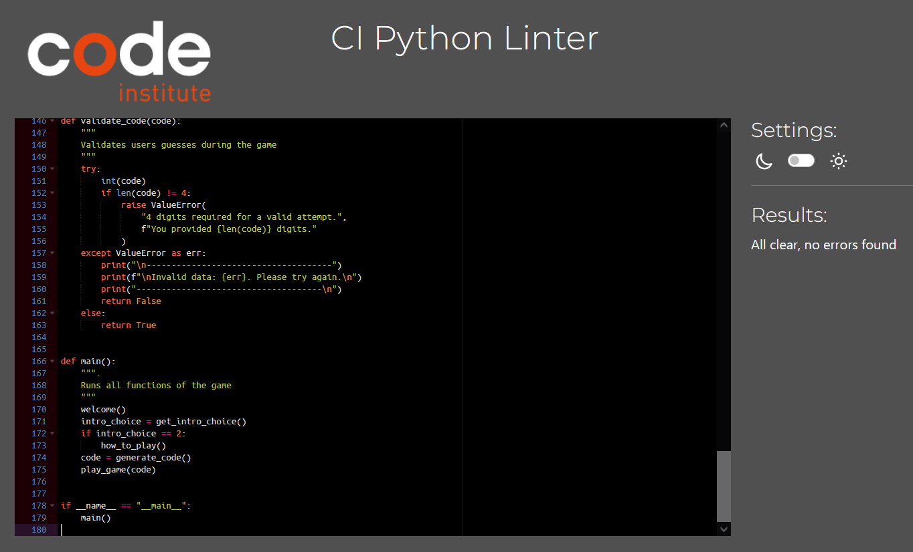

# Code Cracker

Code Cracker is a Python terminal game which runs in the Code Institute mock terminal on Heroku

The game is loosely based on Wordle, and other such games. It offers a simpler, number based alternative, which may be more appealing and accessible to a younger audience than the typical Wordle player.

View the live game [here.](https://code-cracker-adammkeane.herokuapp.com/)

## How To Play

At the start of each game, a secret 4 digit code will be generated.
The secret code will not contain repeat digits.
The user will have 4 attempts to decipher the code.

For each attempt, the user enters a 4 digit code.
After each attempt, we'll let the user know how close they were to cracking the code.

To do this, we'll reprint your 4 digit code, color coding each digit.

Red: this digit is not in the secret code.
Yellow: this digit is in the secret code, but is not in the correct position.
Green: this digit is in the secret code, and is in the correct position!

## Features

### Existing Features
* Welcome Section
    * Welcomes user to the game with ASCII art title, some humor, and options to either jump straight into the game or read how to play first, depening on what they input.
    * Handles invalid input from user by letting the user know their input valid, letting them know how to make it valid, and then gives them another chance to input the selection.





* How To Play Section
    * Explains how the game works to the user in detail, hopefully in a manner that is easy to understand.
    * At the end of the How To Play section, a game is automatically started. This is in order to streamline the process for the user and not require them to input anything else to start playing.



* Game Section
    * A random 4 digit code is generated to start the game, and is hidden from the player.
    * The user is prompted to guess the code. Their attempt is numbered, to allow to know at a glance how many guesses they have left.
    * Only a 4 digit number will be accepted as a guess.
    * Handles invalid input from user by letting the user know their input valid, letting them know how to make it valid, and then gives them another chance to input the selection. An invalid attempt is not counted as an attempt, as that may feel unfair, and the user does not benefit from an invalid attempt, so no need to penalize them for doing so.
    * Once a user makes a valid guess, the game gives the user a color coded version of their guess. This is to help the user improve their next guess and hopefully provides them with a quick and simple way of seeing how close their code is the the seceret code.
    * If a user guesses the correct code on any of their attempts, the game will recognize this and show the winning messsage to the user.
    * Alternatively, if the user runs out of attempts before correctly guessing the code, a message is shown to the user letting them know that they have no more guesses left, and wishes them luck next time.









### Potential Future Features

* Have the option to create a code that can contain repeat digits, to make the game more difficult if the user wants.

## Libraries & Technology Used

**Built-in Python Libraries**

*   random

The random library was imported to access the built-in method of generating a random number selection. This was used to create the random 4 digit code for each game.

**Other**
* [Colorama](https://pypi.org/project/colorama/) for adding colour to fonts.

* [Pyfiglet](https://pypi.org/project/pyfiglet/0.7/) for adding ascii art.


## Validation & Testing

* Passed the Python code through the PEP8 [linter](https://pep8ci.herokuapp.com/#) from Code Institute and got no errors.



I mainly tested the game by:
 * Giving valid inputs and confirming the correct behaviour resulted.
 * Giving invalid inputs and confirming the correct behaviour resulted, eg giving strings were integers were expected. In all cases, the invalid inputs were brought to the user's attention and the user was told how to correct their input.
 * Tested the game in both my GitPod terminal and the Code Institute Heroku terminal.

### Bugs

* Solved Bugs
    * When printing the color coded guess back to the user, each digit was getting printed on a new line. To fix this, I found out from [this](https://www.tutorialspoint.com/how-to-print-in-same-line-in-python) webpage how to make the game print each digit ont he same line, using the "end" attribute. 
    * To check if the user had one, I was having trouble comparing the users guess with the correct code. This was because the user's guess was being input as a string and the secret code was made up of integers. [This](https://www.geeksforgeeks.org/python-converting-all-strings-in-list-to-integers/) wesbite helped me fix that by looping through the string and evaluationg each string digit into an integer.

* Remaining Bugs
    * The 'Code Cracker' ASCII art on the welcome page is too big for the Heroku terminal, and I couldn't work out how to reduce it to an apporiate size before the project deadline.

## Deployment

This game was deplyoyed to Code Institute's mock terminal for Heroku.

* Deployment Step:
    * Created new Heroku app.
    * In settings, added config var (port:8000) and buildpacks (Python & NodeJS)
    * Linked the Heroku app to the GitHub Repository.
    * Manually deployed the game.

View the live game [here.](https://code-cracker-adammkeane.herokuapp.com/)

### Version Control

The site was created using the GitPod and pushed to github to the remote repository ‘code-cracker’.

The following git commands were used throughout development to push code to the remote repo:

```git add .``` - This command was used to add the file(s) to the staging area before they are committed.

```git commit -m 'commit message'``` - This command was used to commit changes to the local repository queue ready for the final step.

```git push``` - This command was used to push all committed code to the remote repository on github.


## Credits 
Thanks to mentor Daisy for her help with the project, and the Battleships sample readme from Code Institute.


